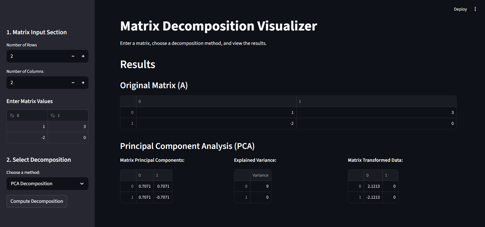

# Matrix Decomposition Visualizer

A Python-based interactive web application for visualizing and performing various matrix decomposition techniques using Streamlit.

The project allows users to input matrices dynamically and compute different matrix factorizations with an intuitive graphical interface.

---

# Features

- Interactive matrix input system
- Multiple matrix decomposition methods
- Real-time matrix visualization
- Error handling and matrix validation
- Educational representation of linear algebra concepts
- Streamlit-based web interface

---

# Supported Decomposition Methods

## LU Decomposition

Factorizes a matrix into:

PA = LU

Where:
- P → Permutation Matrix
- L → Lower Triangular Matrix
- U → Upper Triangular Matrix

---

## QR Decomposition

Factorizes a matrix into:

A = QR

Where:
- Q → Orthogonal Matrix
- R → Upper Triangular Matrix

---

## Eigenvalue Decomposition

Computes:
- Eigenvalues
- Eigenvectors

Using:

AV = VΛ

Where:
- V → Eigenvector Matrix
- Λ → Diagonal Matrix of Eigenvalues

---

## Singular Value Decomposition (SVD)

Factorizes a matrix into:

A = UΣVᵀ

Where:
- U → Left Singular Vectors
- Σ → Singular Values
- Vᵀ → Right Singular Vectors

---

## Cholesky Decomposition

Factorizes a symmetric positive-definite matrix into:

A = LLᵀ

Where:
- L → Lower Triangular Matrix

---

## Principal Component Analysis (PCA)

Performs dimensionality reduction using principal components.

PCA computes:
- Principal Components
- Explained Variance
- Transformed Data

---

# Project Structure

```text
matrix-decomposition-app/
│
├── app.py
│
├── decomposition/
│   ├── lu.py
│   ├── qr.py
│   ├── eigen.py
│   ├── svd.py
│   ├── cholesky.py
│   └── pca.py
│
├── utils/
│   ├── helpers.py
│   └── validators.py
│
└── README.md
```

---

# Technologies Used

- Python
- NumPy
- SciPy
- Pandas
- Scikit-learn
- Streamlit

---

# Installation and Setup

## Step 1: Clone the Repository

```bash
git clone <repository-link>
```

---

## Step 2: Navigate to Project Folder

```bash
cd matrix-decomposition-app
```

---

## Step 3: Install Required Libraries

```bash
pip install numpy scipy pandas scikit-learn streamlit
```

---

## Step 4: Run the Application

```bash
streamlit run app.py
```

---

# Main Functionalities

- Dynamic matrix input
- Matrix validation
- Decomposition computation
- Visualization of decomposed matrices
- PCA analysis
- Numerical linear algebra operations
- Educational demonstration of matrix factorizations

---

# Team Members

- Anshuman Dey
- Abir Mukherjee
- Tushar Maverik
- Ramkrishna Padanga

---

# Screenshots



---

# Future Improvements

- Heatmap visualization of matrices
- Step-by-step decomposition explanation
- Matrix reconstruction verification
- Graphical PCA visualization
- Export results as CSV/PDF
- Support for larger matrices

---

# License

This project is developed for educational and academic purposes.